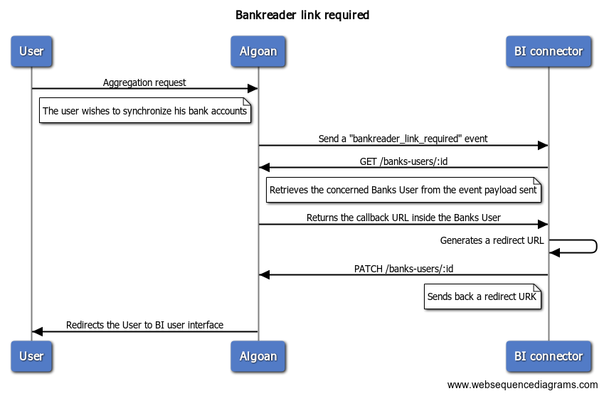
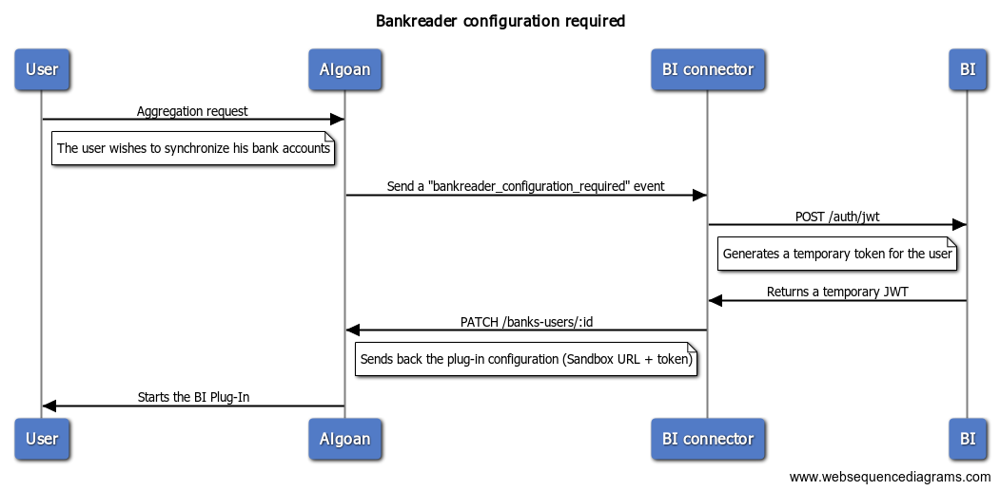
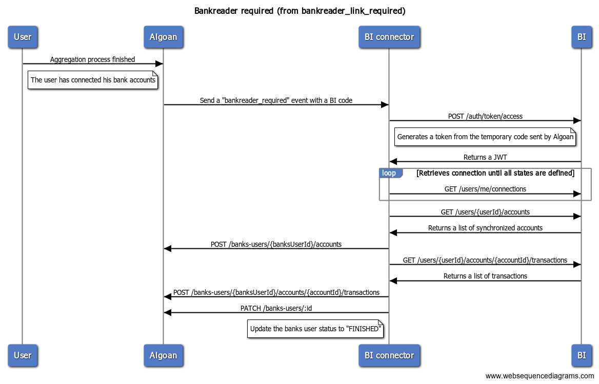
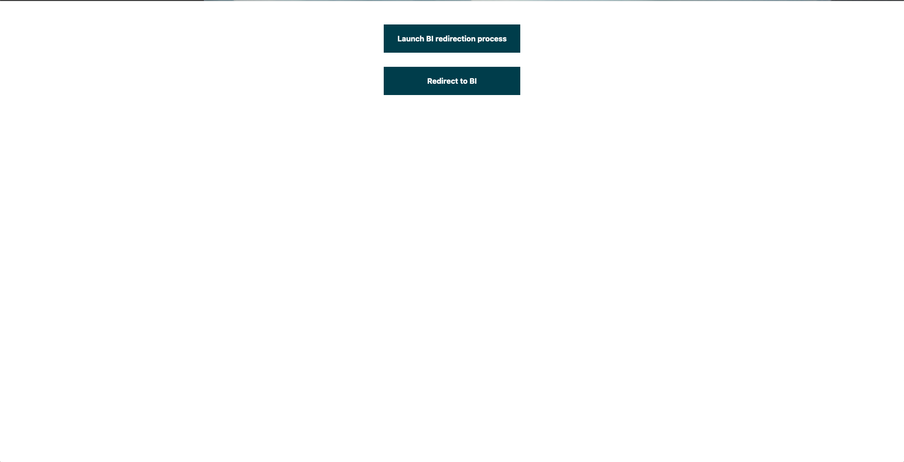

<p align="center">
  <a href="http://algoan.com/" target="blank"></a>
</p>

# Algoan NestJS connector boilerplate

A simple NestJS boilerplate written using [nestjs](https://github.com/nestjs/nest) to connect your service.

## Description

[Nest](https://github.com/nestjs/nest) framework TypeScript starter repository for Algoan connectors.

## Application Structure

- `config/`: stores all configurations for the application. It uses [node-config-ts](https://github.com/tusharmath/node-config-ts) to generate a type definition of the `default.json` file.
- `src/algoan/`: Algoan module getting your service accounts. It uses the [@algoan/rest](https://github.com/algoan/rest-nodejs) library.
- `src/hooks/`: Entry point for your [RestHook](https://developers.algoan.com/public/docs/algoan_documentation/resthooks_and_events/resthooks.html) called by Algoan. It handles [events](https://developers.algoan.com/public/docs/algoan_documentation/resthooks_and_events/event_list.html) you've subscribed to.
- `test/`: contains e2e tests.

## Code Style

This project uses [ESLint](https://eslint.org/) to analyze the TypeScript code. Commit are linted too thanks to [commitlint](https://github.com/conventional-changelog/commitlint) and the [conventional commit format](https://conventionalcommits.org/).

## Installation

```bash
$ npm install
```

## Running the app

```bash
# development
$ npm run start

# watch mode
$ npm run start:dev

# production mode
$ npm run start:prod
```

## Test

```bash
# unit tests
$ npm run test

# e2e tests
$ npm run test:e2e

# test coverage
$ npm run test:cov
```

## Listened Subscriptions

This section describes the process required for each subscriptions

### Bankreader Link Required

When the Budget Insight user interface is not hosted by Algoan, the user needs to be redirected to an external page. The diagram below describes interactions:



### Bankreader configuration required

If the user interface is hosted by Algoan, the connector needs to set the plug-in for the frontend application:



### Bankreader required

When the user has finished the aggregation process, the connector has to retrieve user's banks accounts and transactions:



## How to test

To test locally the Budget Insight process, a simple `index.html` file is rendered. To use it:

- Create a `config/user/{process.env.USER}.json` file to override app configurations. _NOTE_: This application uses [node-config-ts](https://github.com/tusharmath/node-config-ts).
- Run `npm start`
- Go to your favorite browser and navigate to http://localhost:8080. It should display a web page: 



- Click on the first button "Launch BI redirection process". It will create a new Banks User and triggers the hooks controller.
- To be redirected to Budget Insight, click on the second button "Redirect to BI" . This will get your banks-user and redirect you to the Budget Insight redirect URL. If an alert appears, it means that the Banks user has not been updated.


## Support

If you need credentials for your service, please contact support@algoan.com.
